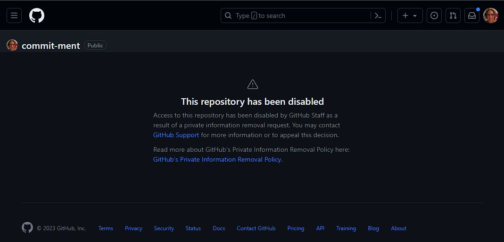

# Commit-ment

This is not the original commit-ment repo. The original one with over 22 million commits was deleted by GitHub Support. A 21 million commit version can be found in an archive [here](https://drive.google.com/file/d/13C2IbyoTvDoMJ9ZfqffzClbPj1xlAA3u/view?usp=drive_link). More info is in the history section.

I believe this repo was the world record for most commits to a single branch on GitHub.

The original source code is in code/.

## Notes

Here are some notes from commit-ment:

I couldn't imagine how many commits GitHub (or really a git repo in general) could take before acting kind of funky.

.. turns out its a lot of commits.

At over ~~15~~ ~~17.5~~ ~22 million commits to master:

* Cloning the master branch can take many minutes (closer to an ~~hour~~ 4 hours). Even pulling to update it can take a while! So its best to use shallow clones as much as possible. Sometimes `git pull` will hang without anything being output for several minutes before saying something.
* `git status` is feeling the pressure. I've never seen a recommendation like this before:

```
It took 26.39 seconds to compute the branch ahead/behind values.
You can use '--no-ahead-behind' to avoid this.
```

... and yes it actually took almost 30 seconds for `git status` to run on my local machine. Running with `--no-ahead-behind` brings it back down to almost instantaneous.

* I rely on the count that GitHub keeps to know how many commits the master branch has. Running:
```
git rev-list --all --count master
```
Sits for a few minutes but then gives a similar number

* ~~A couple times, the GitHub UI has told me ∞ commits on master instead of the actual number.~~ As of 17.5 million commits I much more consistently get ∞ commits on the GitHub page.


* ~~At one point I tried to use GitHub Actions to commit to itself on a cron schedule. Turns out that the runner provided (for free) doesn't really have the performance to make a big impact (in terms of number of commits over a reasonable time) with a repo of this size.~~
* I started using Github Actions to make new branches with commits that my local instance would create PRs (and merge said PRs)
* The main local instance was running on a VM in Azure.
* There are two versions of merging in the code: regular merging via a local clone and merging via making a GitHub PR and then soon after asking GitHub to merge it. This avoids a decent amount of the bottleneck but is can easily get rate-limited. We try to do a simple backoff when detecting rate limitting. It usually makes sense to do big branches with 1000s of commits and PRing it rather than more smaller onces.
* During our PR flow, we commonly see 502 errors from GitHub itself.. Usually they pass on retry.. or 2.. or 3. When it worked, it worked really well. It was amazing how fast PRs could be created and merged.
* I perviously was able to use the GitHub API to figure out a commit count. At this point that doesn't work either.

## History

I made a couple posts about this on Lemmy with some more info: [Possible World Record](https://sh.itjust.works/post/580838) and [Disabled at 22 million commits](https://sh.itjust.works/post/672069).

After about 22 million commits to master, I was contacted by GitHub support and told that they paused the repo, since it was taking a lot of resources. Support was really nice:


At some levels there was an erroneous error about a personal information request. This was confirmed to be an error by GitHub support:



Attempting to clone/pull the repo during this time would yield something like:

```
git pull origin master --no-rebase -vvv
ERROR: Access to this repository has been disabled by GitHub staff due to
excessive resource use. Please contact support via
https://support.github.com/contact to restore access to this repository.
Read about how to decrease the size of your repository:
  https://docs.github.com/articles/what-is-my-disk-quota

fatal: Could not read from remote repository.

Please make sure you have the correct access rights
and the repository exists.
```

Support told me that 5.5TB of data was being used by commit-ment. They pointed me to a tool called `git-sizer`.

Here is what `git-sizer` said about the commit-ment repo:

```
C:\Users\csm10495\Desktop\commit-ment>git-sizer -v
Processing blobs: 115740
Processing trees: 42875648
Processing commits: 21457548
Matching commits to trees: 21457548
Processing annotated tags: 0
Processing references: 4611
| Name                         | Value     | Level of concern               |
| ---------------------------- | --------- | ------------------------------ |
| Overall repository size      |           |                                |
| * Commits                    |           |                                |
|   * Count                    |  21.5 M   | !!!!!!!!!!!!!!!!!!!!!!!!!!!!!! |
|   * Total size               |  5.33 GiB | **********************         |
| * Trees                      |           |                                |
|   * Count                    |  42.9 M   | ****************************   |
|   * Total size               |  5.13 TiB | !!!!!!!!!!!!!!!!!!!!!!!!!!!!!! |
|   * Total tree entries       |  88.2 G   | !!!!!!!!!!!!!!!!!!!!!!!!!!!!!! |
| * Blobs                      |           |                                |
|   * Count                    |   116 k   |                                |
|   * Total size               |  1.34 MiB |                                |
| * Annotated tags             |           |                                |
|   * Count                    |     0     |                                |
| * References                 |           |                                |
|   * Count                    |  4.61 k   |                                |
|     * Branches               |     4     |                                |
|     * Remote-tracking refs   |  4.61 k   |                                |
|                              |           |                                |
| Biggest objects              |           |                                |
| * Commits                    |           |                                |
|   * Maximum size         [1] |   845 B   |                                |
|   * Maximum parents      [2] |     2     |                                |
| * Trees                      |           |                                |
|   * Maximum entries      [3] |  7.62 k   | *******                        |
| * Blobs                      |           |                                |
|   * Maximum size         [4] |  12.6 KiB |                                |
|                              |           |                                |
| History structure            |           |                                |
| * Maximum history depth      |  2.31 M   | ****                           |
| * Maximum tag depth          |     0     |                                |
|                              |           |                                |
| Biggest checkouts            |           |                                |
| * Number of directories  [5] |    10     |                                |
| * Maximum path depth     [6] |     3     |                                |
| * Maximum path length    [6] |    52 B   |                                |
| * Number of files        [5] |  11.7 k   |                                |
| * Total size of files    [7] |  58.0 KiB |                                |
| * Number of symlinks         |     0     |                                |
| * Number of submodules       |     0     |                                |

[1]  75eeddbed6daa2e2420db22ad4c655fc561832ea
[2]  1bee15326dca50e021cd6ee9b2a8676e10a49989 (refs/heads/master)
[3]  40f87ff9ee401c40ec235bbc98b8ab7a1e0e629d (refs/heads/master:branches)
[4]  257b0b5fa5c8cb854d21c6df9b2c0d05644b5621 (59c5c7552ea73f7500910e8d96fbeb64c92d3bf2:commitment.py)
[5]  f09f7e984c14e4a5aa126d631679b6706420fd2e (5ea93fe8aeea3792877b93a90793a41c778c2a02^{tree})
[6]  8f21d3501b72a394f3c5123c135728f751326e31 (refs/heads/master^{tree})
[7]  215bf2e1148b0b32613647f4d316fd15c6f82c9a (1b6e79168c73b7357eafefdfdaffdf8098c217b7^{tree})

C:\Users\csm10495\Desktop\commit-ment>git-sizer --version
git-sizer release 1.5.0
```

5.5TB is pretty close to the 5.13TiB `git-sizer` says. I was ultimately happy to give GitHub this space back.